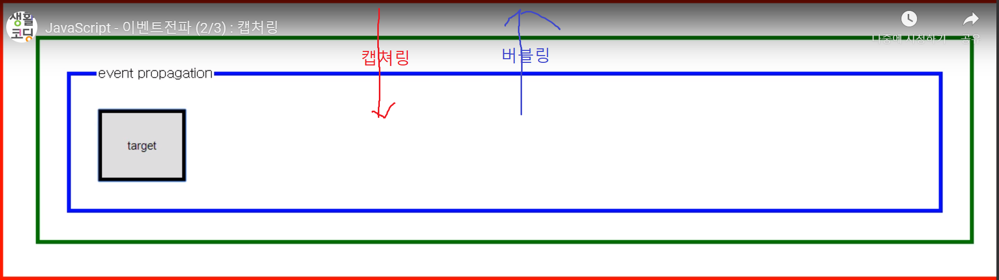

# Event

## event란?

브라우저에서 user가 일으킨 특정한 사건 - 클릭, 텍스트입력, 스크롤 etc...
<hr/>

## terminology

+ event target - 이벤트를 일으키는 주체 대상
+ event type - 발생한 이벤트의 종류
    - [event type](https://developer.mozilla.org/en-US/docs/Web/Reference/Events)
+ event handler - event발생 시, 실행되야하는 코드들
<hr/>

## event 등록

> 크게 3가지 방법이 있다.

1. inline방식 - 태그의 속성으로 이벤트가 있을 때, 그것을 사용하는 방식

+ pros 
  + 간단하다
+ cons
  + 태그에 제어정보가 포함되어있어, 정보로써의 가치가 떨어진다
  + 복잡한 코드 넣기 힘들다(가독성)

```html
<!--자기 자신을 참조하는 불편한 방법-->
<input type="button" id="target" onclick="alert('Hello world, '+document.getElementById('target').value);" value="button" />
<!--this를 통해서 간편하게 참조할 수 있다-->
<input type="button" onclick="alert('Hello world, '+this.value);" value="button" />

```

+ this가 함수의 인자로 왔다는 것은 무슨의미일까?

> 함수가 속해있는 객체를 의미, 즉 위의 코드에서는 input태그를 의미하고 그것의 value를 참조했으므로 출력값은 Hello world, button이 출력되게 된다.


2. property listener

```html

<input type="button" id="target" value="button" />
<script>
     var t = document.getElementById('target');
    t.onclick = function(event){ // 클릭 시, browser가 함수호출하면서 클릭이벤트를 함수의 인자로 넘긴다.
        alert('Hello world, '+event.target.value) // 출력 Hello world, button
        console.dir(event) // 호출된 이벤트의 속성 알아보기 console의 dir명령은 인자로 넘어간 객체의 속성을 조회하는 메소드
    }
</script>

```

@cross browsing issue

ie8 이하 버전에서는 이벤트 객체를 핸들러의 인자가 아니라 전역객체의 event 프로퍼티로 제공한다. 또한 target 프로퍼티도 지원하지 않는다. 아래는 이 문제를 해소하기 위한 코드다.

현업에서는 라이브러리가 이러한 크로스 브라우징 이슈를 거의 자동으로 보정하기 때문에, 이슈가 잘 발생하지는 않는다.

```html
<input type="button" id="target" value="button" />
<script>
    var t = document.getElementById('target');
    t.onclick = function(event){
        var event = event || window.event; // event가 없을 때, 윈도우.event를 이용 false || true = true
        var target = event.target || event.srcElement; // target속성이 예전엔 srcElement로 쓰였음
        alert('Hello world, '+target.value)
    }
</script>
```

3. addEventListener()

```html
<input type="button" id="target" value="button" />
<script>
    var t = document.getElementById('target');
    t.addEventListener('click', function(event){ // addEventListener(event type, event handler)
        alert('Hello world, '+event.target.value);
    });
</script>
```

+ pros
    - 하나의 이벤트에 대해 복수개의 핸들러 등록가능(property listener는 단 하나의 핸들러만을 등록가능, 여러개를 써도 마지막으로 쓴 것만 덮어씌우기때문)
    - 하나의 핸들러를 만들어 놓으면, 여러개의 이벤트에 적용가능(재사용성)
```html
<input type="button" id="target1" value="button1" />
<input type="button" id="target2" value="button2" />
<script>
    var t1 = document.getElementById('target1');
    var t2 = document.getElementById('target2');
    function btn_listener(event){
        switch(event.target.id){ // 이벤트 타겟을 식별할 수 있는 방법
            case 'target1':
                alert(1);
                break;
            case 'target2':
                alert(2);
                break;
        }
    }
    t1.addEventListener('click', btn_listener);
    t2.addEventListener('click', btn_listener);
</script>
```
<hr/>

## 이벤트전파(버블링, 캡쳐링)



event target와 상속관계에 있는 태그들에도 이벤트가 있을 경우
+ 루트노드로부터 event target까지의 순서로 이벤트가 발생하는 것을 캡쳐링이라고 한다.
+ event target부터 루트노드까지의 순서로 거슬로 올라가며 이벤트가 발생하는 것을 버블링이라고 한다.

> 캡쳐링
+ 코드
```html
<html>
    <head>
        <style>
            html{border:5px solid red;padding:30px;}
            body{border:5px solid green;padding:30px;}
            fieldset{border:5px solid blue;padding:30px;}
            input{border:5px solid black;padding:30px;}
        </style>
    </head>
    <body>
        <fieldset>
            <legend>event propagation</legend>
            <input type="button" id="target" value="target">          
        </fieldset>
        <script>
        function handler(event){
            var phases = ['capturing', 'target', 'bubbling']
            console.log(event.target.nodeName, this.nodeName, phases[event.eventPhase-1]);
        }
        document.getElementById('target').addEventListener('click', handler, true);
        document.querySelector('fieldset').addEventListener('click', handler, true);
        document.querySelector('body').addEventListener('click', handler, true);
        document.querySelector('html').addEventListener('click', handler, true);
        </script>
    </body>
</html>
```
+ 결과
```bash
INPUT HTML capturing
INPUT BODY capturing
INPUT FIELDSET capturing
INPUT INPUT target
```

> 버블링

+ 코드
```html
<html>
    <head>
        <style>
            html{border:5px solid red;padding:30px;}
            body{border:5px solid green;padding:30px;}
            fieldset{border:5px solid blue;padding:30px;}
            input{border:5px solid black;padding:30px;}
        </style>
    </head>
    <body>
        <fieldset>
            <legend>event propagation</legend>
            <input type="button" id="target" value="target">          
        </fieldset>
        <script>
        function handler(event){
            var phases = ['capturing', 'target', 'bubbling']
            console.log(event.target.nodeName, this.nodeName, phases[event.eventPhase-1]);
        }
        document.getElementById('target').addEventListener('click', handler, false); // 캡쳐링과의 차이 - 세 번째의 인자(capturing의 실행여부)의 값이 false로 변경됨
        document.querySelector('fieldset').addEventListener('click', handler, false);
        document.querySelector('body').addEventListener('click', handler, false);
        document.querySelector('html').addEventListener('click', handler, false);
        </script>
    </body>
</html>

```
+ 결과

```bash
INPUT INPUT target
INPUT FIELDSET bubbling
INPUT BODY bubbling
INPUT HTML bubbling
```

eventPhase는 현재 이벤트 흐름의 실행단계를 보여주는 상수입니다.
1 : capturing phase
2 : target phase
3 : bubbling phase

```javascript
document.getElementById('target').addEventListener('click', handler, false); // 2번째로 실행 캡쳐링 -> 버블링, true나 false나 결과는 동일
document.querySelector('fieldset').addEventListener('click', handler, false); // 3번째로 실행 버블링
document.querySelector('body').addEventListener('click', handler, true); // 1번째로 실행 캡쳐링
document.querySelector('html').addEventListener('click', handler, false); // 4번째로 실행 버블링
```

> 전파를 멈추는 방법

+ event.stopPropagation();

  + 코드
```javascript
function handler(event){
    var phases = ['capturing', 'target', 'bubbling']
    console.log(event.target.nodeName, this.nodeName, phases[event.eventPhase-1]);
}
function stophandler(event){
   handler(event);
    event.stopPropagation();
}
document.getElementById('target').addEventListener('click', handler, false);
document.querySelector('fieldset').addEventListener('click', handler, false);
document.querySelector('body').addEventListener('click', stophandler, false);
document.querySelector('html').addEventListener('click', handler, false);
```
  + 결과
```bash
INPUT INPUT target
INPUT FIELDSET bubbling
INPUT BODY bubbling
```
<hr/>

## 이벤트 기본동작 취소

> 기본동작

웹브라우저의 구성요소들은 각각 기본적인 동작 방법을 가지고 있다.

+ 텍스트 필드에 포커스를 준 상태에서 키보드를 입력하면(사용자의 이벤트) 텍스트가 입력된다.
+ 폼에서 submit 버튼을 누르면(사용자의 이벤트) 데이터가 전송된다.
+ a 태그를 클릭(사용자의 이벤트)하면 href 속성의 URL로 이동한다.

이러한 기본적인 동작들을 기본 이벤트라고 하는데 사용자가 만든 이벤트를 이용해서 이러한 기본 동작을 취소할 수 있다.

1. inline방식에서 기본동작 취소

> 핸들러의 리턴값을 false로 설정한다.

```html
<p>
    <label>prevent event on</label><input id="prevent" type="checkbox" name="eventprevent" value="on" /> <!-- 체크박스를 통해 true false 상태를 만들 수 있다. -->
</p>
<p>
    <a href="http://opentutorials.org" onclick="if(document.getElementById('prevent').checked) return false;">opentutorials</a>
</p>
<p>
    <form action="http://opentutorials.org" onsubmit="if(document.getElementById('prevent').checked) return false;">
            <input type="submit" /> <!-- 누르면 form 태그의 action에서 지정한 url로 데이터를 전송하고 제출 시 이벤트 발생하게함 -->
    </form>
</p>
```

2. property 방식

> 핸들러의 리턴값을 false로 설정한다.

```javascript
    document.querySelector('a').onclick = function(event){
         if(document.getElementById('prevent').checked)
             return false;
    };
     
    document.querySelector('form').onclick = function(event){
        if(document.getElementById('prevent').checked)
            return false;
    };

```

3. addEventListener

> 핸들러 함수에서 event.preventDefault();를 호출

```javascript
document.querySelector('a').addEventListener('click', function(event){
    if(document.getElementById('prevent').checked)
        event.preventDefault();
});
 
document.querySelector('form').addEventListener('submit', function(event){
    if(document.getElementById('prevent').checked)
        event.preventDefault();
});
```
<hr/>

## 주요 이벤트 타입

1. 폼

1) submit 
- 사용자가 입력한 정보를 서버로 전송

```html
<form id="target" action="result.html">
    <label for="name">name</label> <input id="name" type="name" />
    <input type="submit" />
</form>
<script>
var t = document.getElementById('target');
t.addEventListener('submit', function(event){
    if(document.getElementById('name').value.length === 0){
        alert('Name 필드의 값이 누락 되었습니다');
        event.preventDefault();
    }
});
</script>

```
2) change 
- 폼 컨트롤의 값이 바뀌고 그 객체(입력창, 체크박스 etc..)를 빠져나왔을 때(엔터치거나 해당 객체가 아닌 다른 곳을 클릭하거나..) 발생하는 이벤트
- input(text,radio,checkbox), textarea, select 태그에 적용된다.
```html
<p id="result"></p>
<input id="target" type="name" />
<script>
var t = document.getElementById('target');
t.addEventListener('change', function(event){
    document.getElementById('result').innerHTML=event.target.value;
});
</script>
```
3) focus
- 이벤트타겟을 동작시키려고 해당 객체에 포커스를 맞추는 행위 - ex) 입력창에 입력을 하기위해 클릭하는 행위

4) blur
- 이벤트를 일으키기 위해 어떤 동작을 취하고 빠져나오는 것이 - ex) 입력이 끝나고 제출을 위해 다른곳을 클릭하거나 엔터를 치는 행위

foucs, blur모두 다음 태그를 제외한 모든 태그에서 발생한다. 
```html
<base>, <bdo>, <br>, <head>, <html>, <iframe>, <meta>, <param>, <script>, <style>, <title>
```